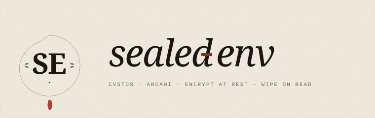

<div align="center">



<br/>

**Stop committing `.env` files. Stop hoping a leak doesn't happen.**

A cross-stack, zero-trust secret management library for **Node.js** and **Java/Spring Boot** —
with optional TOTP-based unsealing for production deploys.

[](https://www.npmjs.com/package/sealed-env)
[](https://central.sonatype.com/artifact/io.github.davidalmeidac/sealed-env)
[](https://github.com/davidalmeidac/sealed-env/actions/workflows/node-ci.yml)
[](https://github.com/davidalmeidac/sealed-env/actions/workflows/java-ci.yml)
[](LICENSE)
[](THREAT_MODEL.md)
[](https://www.cve.org/CVERecord?id=CVE-2026-45091)

[Docs](docs/) · [Threat Model](THREAT_MODEL.md) · [File Format](SPEC.md) · [Security Policy](SECURITY.md) · [Landing](https://davidalmeidac.github.io/sealed-env/)

</div>

---

## Why this exists

In **2025 alone**, supply-chain attacks on the JavaScript ecosystem stole **thousands of
plaintext secrets** from CI/CD pipelines and developer machines. The Shai-Hulud worm
(November 2025) compromised over **25,000 repositories** by scanning for `.env` files
and exfiltrating their contents to public GitHub repos. On **May 12, 2026**, TeamPCP
open-sourced the full framework on GitHub; clones appeared within 48 hours.

The lesson is simple: **plaintext `.env` is dead**. And encrypted-at-rest alone isn't
enough — if the master key leaks (and they do — see the tj-actions and GhostAction
campaigns), the entire vault opens.

`sealed-env` solves both halves: it encrypts your secrets at rest, **and** it can require
a fresh TOTP code from a human operator before each production deploy. Even if your CI
pipeline is fully compromised, attackers cannot decrypt without the operator's phone.

> **Honest scope claim**: sealed-env *reduces the impact* of Shai-Hulud-class
> supply-chain attacks by keeping master keys out of disk and `process.env`
> when configured with `sealed-env keychain push` and enterprise mode + short-TTL
> unseal tokens. It **does not prevent** the initial compromise of a developer
> machine or CI runner. Full per-module analysis:
> [`threat-research/analysis/shai-hulud-defense.md`](./threat-research/analysis/shai-hulud-defense.md).
> Run `sealed-env doctor` for an automated posture check.

## What you get

- A `.env.sealed` file format that's **identical across Node and Java**. Mix stacks freely.
- **Three security modes** the user picks: `basic` for dev, `team` for staging,
  `enterprise` for production with TOTP unseal.
- **Zero runtime dependencies** in the Node package. Only Node's built-in `crypto` and `fs`.
- A **published threat model** that says exactly what we defend against and what we don't.
- A **CLI** (`npx sealed-env`) and a **Spring Boot starter** (Java).

## Cross-stack architecture

```
   ┌─────────────────────────┐         ┌─────────────────────────┐
   │  Node side              │         │  Java side              │
   │  ────────────           │         │  ────────────           │
   │  • CLI: sealed-env seal │         │  • SealedEnv core lib   │
   │  • npm: sealed-env      │         │  • Spring Boot starter  │
   │  • writes KDF=scrypt    │         │  • writes KDF=argon2id  │
   └────────────┬────────────┘         └────────────┬────────────┘
                │                                   │
                │  both speak SEALED-ENV-V1         │
                │  (byte-for-byte spec compliance)  │
                ▼                                   ▼
            ┌────────────────────────────────────────┐
            │            .env.sealed                 │
            │  ───────────────────────────           │
            │  SEALED-ENV-V1 MODE=team               │
            │  KDF=<scrypt|argon2id>                 │
            │  KDF-PARAMS=...   SALT=...             │
            │  NONCE=...        AAD-DIGEST=...       │
            │  HMAC=...         CREATED=2026-...     │
            │                                        │
            │  <base64 ciphertext + GCM tag>         │
            └────────────────────────────────────────┘
                ▲                                   ▲
                │       a file written by one       │
                │       stack decrypts in the       │
                │       other — no conversion       │
                │                                   │
   ┌────────────┴────────────┐         ┌────────────┴────────────┐
   │  Node app reads it      │         │  Java app reads it      │
   │  (loadSealed())         │         │  (Spring Environment)   │
   └─────────────────────────┘         └─────────────────────────┘
```

## Verify the install

From `0.2.1` onwards, every npm release ships with **SLSA Build Level 3
provenance** signed via Sigstore through GitHub Actions trusted
publishing. After installing, you can confirm that the tarball was
built from the source we publish (not from a compromised pipeline):

```bash
npm audit signatures sealed-env
```

Expect output that includes `verified` for `sealed-env` with a
signature link to a Sigstore transparency log entry. If the command
reports anything else, **do not run sealed-env** — open an issue first.

This is a real check, not a marketing pixel: the TanStack supply-chain
attack of May 2026 published malicious packages with valid-looking
SLSA Build Level 3 provenance, so provenance alone is insufficient.
But combined with version pinning + release-age cooldowns (`pnpm 11
minimumReleaseAge: 24h` or `yarn npmMinimalAgeGate: 3d`), it's a
meaningful defensive layer.

## 30-second tour (Node)

```bash
# 1. Install
npm install sealed-env

# 2. Initialize a vault for your project
npx sealed-env init
# → generates a master key (saved locally to .env.local, gitignored)
# → if you choose 'enterprise' mode, also displays a QR code for your authenticator

# 3. Encrypt your existing .env
npx sealed-env encrypt .env
# → creates .env.sealed (commit this!)

# 4. Use it in code — no API change
import 'sealed-env/config';
console.log(process.env.STRIPE_API_KEY);  // works as if it were a normal .env
```

## 30-second tour (Spring Boot)

```xml
<dependency>
    <groupId>io.github.davidalmeidac</groupId>
    <artifactId>sealed-env-spring-boot-starter</artifactId>
    <version>0.1.0</version>
</dependency>
```

```yaml
# application.yml
sealed-env:
  file: .env.sealed
  key-source: env
```

```java
@Value("${stripe.api.key}")  // resolved transparently from .env.sealed
private String stripeKey;
```

## The three modes — visualized

```
   basic                    team                     enterprise
   ─────                    ────                     ──────────

   .env.sealed              .env.sealed              .env.sealed
        │                        │                        │
        ▼                        ▼                        ▼
   ┌─────────┐              ┌─────────┐              ┌─────────┐
   │ AES-GCM │              │  HMAC   │              │  HMAC   │
   │ decrypt │              │ verify  │              │ verify  │
   └────┬────┘              └────┬────┘              └────┬────┘
        │                        ▼                        ▼
        ▼                   ┌─────────┐              ┌─────────┐
   plaintext                │ AES-GCM │              │  TOTP   │
                            │ decrypt │              │  token  │
                            └────┬────┘              │ verify  │
                                 ▼                   └────┬────┘
                            plaintext                     ▼
                                                     ┌─────────┐
   ▲                        ▲                        │ deploy  │
   │ master_key             │ + signing_key          │  bind   │
                                                     └────┬────┘
                                                          ▼
                                                     ┌─────────┐
                                                     │ AES-GCM │
                                                     │ decrypt │
                                                     └────┬────┘
                                                          ▼
                                                     plaintext

                                                     ▲
                                                     │ + unseal token (carries
                                                     │   salt-bound TOTP epoch)
                                                     │ + deploy_id
```

## The three modes

|  | basic | team | enterprise |
|---|:---:|:---:|:---:|
| AES-256-GCM cipher | ✓ | ✓ | ✓ |
| Argon2id key derivation | ✓ | ✓ | ✓ |
| HMAC integrity tag | — | ✓ | ✓ |
| TOTP unseal required | — | — | ✓ |
| Deploy-bound unseal tokens | — | — | ✓ |
| Replay protection | — | — | ✓ |
| Memory wipe after read | ✓ | ✓ | ✓ |
| Host-side decrypt (`deploy --remote`) | ✓ | ✓ | ✓ |
| Suitable for | personal projects | staging, small teams | production, fintech, PII |

Pick the one that fits your threat model. Upgrade later with one command:

```bash
npx sealed-env upgrade --to enterprise
```

## How `enterprise` mode works

```
┌──────────────┐  1. push     ┌──────────────┐
│   developer  │ ───────────▶ │   github     │
└──────────────┘              └──────────────┘
                                     │ 2. CI runs
                                     ▼
                              ┌──────────────┐
                              │  CI pipeline │  paused, waiting for unseal
                              └──────────────┘
                                     │
                                     │ 3. notifies operator
                                     ▼
                              ┌──────────────┐
                              │   operator   │  4. opens authenticator app,
                              │   (you)      │     reads 6-digit TOTP code
                              └──────────────┘
                                     │
                                     │ 5. runs:
                                     │    sealed-env unseal --totp 482914 \
                                     │      --deploy-id <commit-sha>
                                     ▼
                              ┌──────────────────────────────────────┐
                              │ unseal token (60s lifetime, bound to │
                              │ this specific deploy)                │
                              └──────────────────────────────────────┘
                                     │ 6. paste into CI form
                                     ▼
                              ┌──────────────┐
                              │ deploy runs  │  decrypts .env.sealed
                              │ to prod      │  with master_key + token
                              └──────────────┘

If the master key leaks AFTER the deploy → attacker still needs the operator's
TOTP. If the TOTP token leaks → useless for the next deploy (different commit).
```

## How it compares

The honest version. Different tools for different threat models — pick the
one that matches yours.

|  | **sealed-env** | dotenv | dotenvx | Doppler | HashiCorp Vault | AWS Secrets Manager | jasypt |
|---|:---:|:---:|:---:|:---:|:---:|:---:|:---:|
| **Encryption at rest** | ✅ | ❌ plaintext | ✅ | ✅ | ✅ | ✅ | ✅ |
| **Cross-stack (Node + Java)** | ✅ same wire format | n/a | Node only | language-agnostic (HTTP) | language-agnostic (HTTP) | language-agnostic (HTTP) | Java only |
| **No external service required** | ✅ | ✅ | ✅ | ❌ paid SaaS | ❌ self-hosted server | ❌ AWS | ✅ |
| **TOTP unseal at deploy time** | ✅ | ❌ | ❌ | ❌ | ⚠️ via plugin | ❌ | ❌ |
| **Replay protection (deploy-bound tokens)** | ✅ | ❌ | ❌ | ❌ | ⚠️ partial | ❌ | ❌ |
| **Public threat model** | ✅ | n/a | partial | NDA only | ✅ | ✅ | ❌ |
| **Zero runtime dependencies (Node)** | ✅ | ✅ | ❌ (8+ deps) | ❌ SDK | ❌ SDK | ❌ SDK | n/a |
| **Spring Boot autoconfiguration** | ✅ | n/a | n/a | community | community | community | manual |
| **Memory wipe after key derivation** | ✅ | n/a | ❌ | ❌ | ❌ | ❌ | ❌ |
| **License** | MIT | MIT | MIT | proprietary | MPL 2.0 | proprietary | Apache 2.0 |
| **Cost** | free | free | free | $0–$15/user/mo | free / Enterprise $ | $0.40/secret/mo | free |

### When to pick which

- **`dotenv`** — solo dev, dev environment only, never production. Fine.
- **`dotenvx`** — Node-only project, encryption at rest is enough, you trust your CI keystore. Fine.
- **`Doppler` / `AWS Secrets Manager`** — you already pay for the platform, comfortable with vendor lock-in, want centralized rotation across many services. Good.
- **`HashiCorp Vault`** — you have ops capacity to run a Vault cluster, need fine-grained policies, and dynamic secrets (DB credentials per session). Heavy but powerful.
- **`jasypt`** — Java-only project, encryption at rest is enough, you don't need cross-stack. Fine.
- **`sealed-env`** — you want **encryption at rest + a hard floor against compromised CI/CD** (TOTP-bound deploys), no external service, and your stack is Node, Java/Spring Boot, or both. The defense ceiling is higher than dotenvx/jasypt; the operational cost is lower than Vault.

### What `sealed-env` is **not**

- Not a centralized secret manager (no rotation API, no audit log, no team policies).
- Not a substitute for HashiCorp Vault when you need dynamic per-session credentials.
- Not a fit if you want a SaaS dashboard.

If your team needs the Doppler/Vault feature set, use them. `sealed-env` is the right pick when you want a static, file-based, version-controllable encrypted secret with a higher security floor than `dotenvx`.

## Runnable examples

Pre-sealed apps you can clone and run in 60 seconds:

- 📦 [examples/node-express](examples/node-express) — Node + Express server using `import 'sealed-env/config'`
- ☕ [examples/spring-boot](examples/spring-boot) — Java + Spring Boot 3 with the auto-config starter

The demo master key is checked in alongside each example so the apps
work out of the box. **It's public — never use it in real projects.**

## Companion: sealed-env Studio (pre-alpha)

A desktop GUI on top of `sealed-env`, for the people who don't live in
the terminal. Built with Tauri 2 + React + TypeScript, with its own
Rust implementation of `SEALED-ENV-V1` — the **third stack** alongside
Node and Java, validated against the same cross-stack test vectors.

What works today:

- **Viewer** — open a `.env.sealed` file, unlock with master / signing /
  TOTP, browse and mask values.
- **Init wizard** — 5-step flow (folder → mode → source → keys →
  review) for `basic`, `team`, and `enterprise`. Auto-detects `.env`,
  `.env.example`, `.env.sample`, `.env.template`, `.env.dist`. QR code
  for enterprise authenticator pairing. Auto-appends `.env` to
  `.gitignore`.
- **Recent projects** + settings panel (default mode, gitignore
  toggle, value masking, Argon2id parameter tuning).

Still pre-alpha — looking for testers and contributors. The Rust core
reads files sealed by the Node CLI and Java library byte-for-byte
(validated by `decrypts_node_enterprise_vector` and friends in CI).

[**→ github.com/davidalmeidac/sealed-env-studio**](https://github.com/davidalmeidac/sealed-env-studio)

## Documentation

**[→ Full documentation index](docs/README.md)** — start here if you're new.

### Getting started
- 📖 [Overview](docs/01-overview.md) — what `sealed-env` is and isn't
- 🚀 [Quick start: Node](docs/03-quickstart-node.md)
- 🍃 [Quick start: Java + Spring Boot](docs/04-quickstart-java.md)
- 🔑 [Enterprise mode walkthrough](docs/05-enterprise-mode.md) — TOTP + deploy binding

### Operations
- 🛠️ [Operational guide](docs/07-operational-guide.md) — for sysadmins, managers, and founders (no code)
- ☁️ [CI/CD + cloud recipes](docs/08-cicd-recipes.md) — GitHub Actions, GitLab, Bitbucket, CircleCI, Jenkins, Azure, AWS, GCP, Vercel, Railway, Docker, K8s
- 🔄 [Project lifecycle](docs/09-lifecycle.md) — init → onboarding → deploy as one narrative
- 🎯 [Decrypt strategies](docs/10-decrypt-strategies.md) — host-side vs in-process trade-off
- 🚨 [Incident response](docs/incident-response.md) — playbook for a compromised host (⚠ deadman switch warning)

### Reference
- 📐 [File format anatomy](docs/06-format-anatomy.md) — what's inside `.env.sealed`
- 📋 [Format specification](SPEC.md) — the canonical wire format (v1)
- 🔍 [Secret patterns](SECRET-PATTERNS.md) — canonical regex spec for tools like gitleaks / trufflehog
- 🛡️ [Security policy](SECURITY.md) — how to report vulnerabilities
- 🔐 [Threat model](THREAT_MODEL.md) — which 2024-2026 attacks `sealed-env` defends against

### Threat research
- 🪱 [Shai-Hulud defensive analysis](threat-research/analysis/shai-hulud-defense.md) — module-by-module mapping of TTPs to defenses
- 📊 [IOC table](threat-research/analysis/ioc-table.md) — consolidated indicators from public research
- 🛣️ [Improvement roadmap](threat-research/analysis/improvement-roadmap.md) — prioritized hardening for 0.2.2 / 0.3.0
- 💡 [Future: supply-chain IOC feed bot](threat-research/analysis/future-supply-chain-monitor.md) — design brainstorm

## Project status

**v0.1.0 — stable.** The wire format (`SEALED-ENV-V1`) is **frozen** and
will remain readable forever. The public API is stable. Bug-fix and
non-breaking feature releases land as `0.1.x`; breaking changes wait
for `0.2.0`.

**What's in 0.1.0:**

- [x] Three modes: `basic`, `team`, `enterprise` (TOTP-bound deploys)
- [x] Node CLI (`init`, `encrypt`, `decrypt`, `get`/`set`/`edit`/`diff`, `exec`, `deploy`, `keychain`)
- [x] `deploy --remote` for Model A host-side decrypt deploys
- [x] Cross-stack: Node + Java libraries reading the same wire format
- [x] Spring Boot 3 starter (auto-config + `@Value` support)
- [x] OS keychain backend (Windows DPAPI, macOS Keychain, Linux secret-tool)
- [x] 17 platform CI/CD recipes including OIDC federation
- [x] Cryptographic test vectors validated cross-stack in CI

**Roadmap:**

- [ ] v0.1.x — `sealed-env doctor` + `install-hooks` + library-side `.env.local` autoload (non-breaking)
- [ ] v0.2.0 — Java CLI (Maven-distributed) · Shamir Secret Sharing · sidecar pattern
- [ ] v0.3.0 — `memfd_secret` Linux memory protection · heap-dump filter
- [ ] v1.0 — Hardware-backed wrapping (TPM / Secure Enclave / YubiKey)

**Companion projects:**

- [sealed-env-studio](https://github.com/davidalmeidac/sealed-env-studio) — desktop GUI (Tauri + React + Rust), Phase 1 viewer + Phase 2 init wizard implemented, cross-stack interop validated, pre-alpha

## Contributing

This is a security-sensitive project. Contributions are very welcome but please read
[SECURITY.md](SECURITY.md) first. Crypto changes require explicit discussion.

## License

[MIT](LICENSE) — David Almeida, 2026.

---

<div align="center">
<sub>
Built openly in Bucaramanga, Colombia.<br/>
"Encrypt at rest. Authenticate at deploy. Wipe on read."
</sub>
</div>
