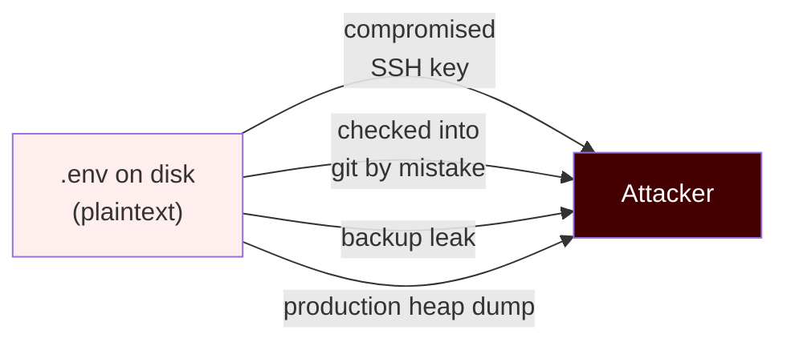
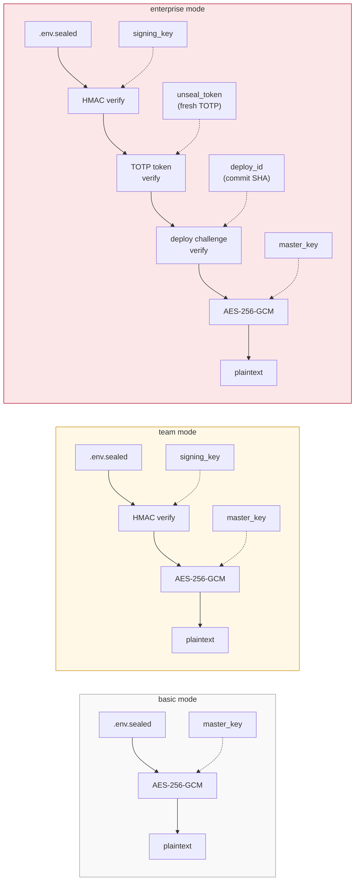
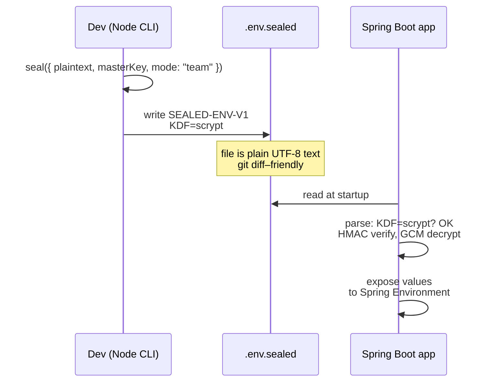

# Overview

`sealed-env` is an encrypted-at-rest format for `.env` files, with optional
TOTP-bound unsealing for production deploys. It is **cross-stack**: a file
written by Node decrypts in Java, and vice versa.

## What problem does it solve?

A plaintext `.env` is a single point of failure. Anything that grants read
access to the file system or process memory grants total credential access.

`sealed-env` flips that: the file on disk is **only useful with a separate
key**, and in `enterprise` mode, **only useful with a fresh TOTP code at
deploy time**.

## The three modes

| Mode | Compromise of master key alone | Compromise of all keys + filesystem | Replay across deploys |
|---|---|---|---|
| `basic` | Full breach | Full breach | N/A |
| `team` | Cannot decrypt (HMAC fails) | Full breach | N/A |
| `enterprise` | Cannot decrypt | Cannot decrypt without TOTP | Blocked |

## Cross-stack interop

Both implementations honor the **same v1 specification**, byte-for-byte.

## Where to next

- [Threat model](./02-threat-model.md) — which attacks `sealed-env` defends against
- [Format spec](../SPEC.md) — the canonical wire format
- [Quick start: Node](./03-quickstart-node.md)
- [Quick start: Java + Spring Boot](./04-quickstart-java.md)
- [Enterprise mode walkthrough](./05-enterprise-mode.md) — TOTP + deploy binding
