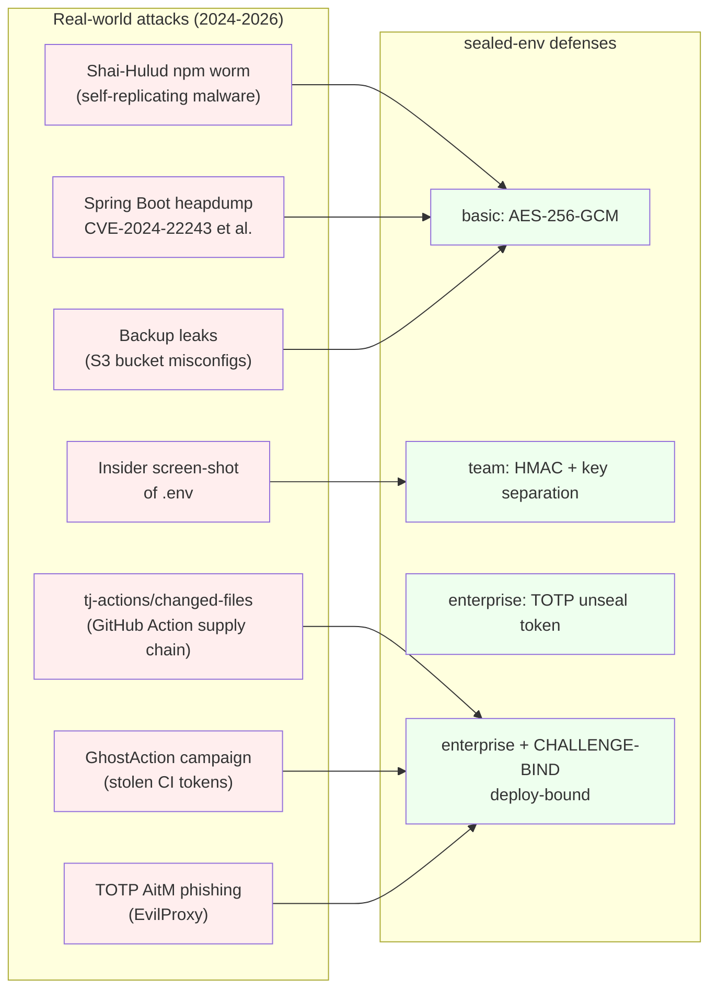
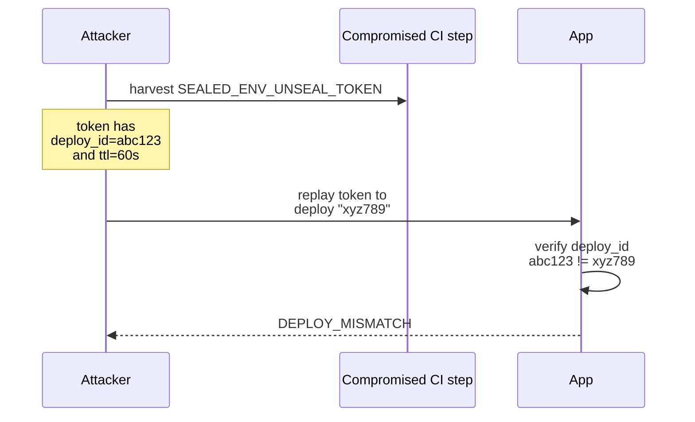

# Threat Model

`sealed-env` was designed against **specific real-world attacks from
2024-2026**, not against an abstract "secrets shouldn't be plaintext" goal.
This page maps each attack class to the mode that defends against it.

## Coverage matrix

## Detail per attack

### 1. npm supply-chain (Shai-Hulud, etc.)

**Pattern**: a transitive dependency exfiltrates `process.env` to a remote
server during install, build, or runtime.

**Defense**: in `basic` mode the sealed file on disk is unreadable without
the master key. Even if malware steals the file, decryption requires a key
that the malware would also have to find. In CI we recommend:
- Master key only in CI secret store (never on disk)
- `enterprise` mode for production where the master key alone is insufficient

### 2. GitHub Action supply chain (tj-actions/changed-files)

**Pattern**: a popular action is compromised; every job using it leaks its
environment to the attacker. The 2025 incident exposed thousands of repos.

**Defense**: `enterprise + CHALLENGE-BIND=enabled`. A captured unseal token
is bound to one specific commit SHA; replaying it against a different
deploy fails with `DEPLOY_MISMATCH`.

### 3. Spring heap-dump CVEs

**Pattern**: an exposed actuator (`/actuator/heapdump`) returns the JVM heap,
which contains every environment variable in plaintext.

**Defense**: in `enterprise` mode, by the time the heap is dumped, the master
key has already been wiped from memory after decryption. The decrypted
values still live in `Environment`, but the master key — required to decrypt
future restarts — is gone.

> **Note**: this is a partial defense. The right fix is also locking down
> actuators. `sealed-env` raises the bar; it doesn't replace least-privilege.

### 4. Backup leaks

**Pattern**: an S3 bucket containing a project backup is exposed publicly.

**Defense**: `basic` mode is sufficient. The backup contains only ciphertext.

### 5. TOTP AitM phishing

**Pattern**: attacker phishes the operator with an EvilProxy-style site,
relays the TOTP code in real time, gains a valid token.

**Defense**: `enterprise + CHALLENGE-BIND=enabled`. Even if the attacker
gets a valid TOTP code, the token they generate is bound to *their*
fake deploy id. Replaying it against the real deploy fails.

> **Note**: this defense relies on the operator (or CI) generating the
> deploy id from a verifiable source — typically the git commit SHA being
> deployed. The full mitigation requires hardware FIDO2 keys; TOTP raises
> cost but does not eliminate AitM. Roadmap §11 covers FIDO2.

## What `sealed-env` does NOT defend against

- **A truly compromised production host** with a running attacker. Once
  the application has decrypted the values into `Environment`, an attacker
  with shell access to that process can read them.
- **A compromised key-management system**. If the operator's KMS is owned,
  game over. (Future work: HSM-backed master keys, in-progress for v0.2.x.)
- **Accidental leakage in logs or error messages**. Use `sealed-env` with
  proper logging hygiene; don't log `process.env` or `Environment` dumps.
- **Sealed-file rotation gaps**. If old files are kept after rotation and
  the old key is stolen, the old data leaks. Always delete old sealed files
  after rotation.
