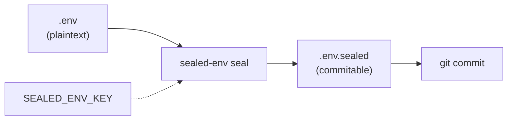
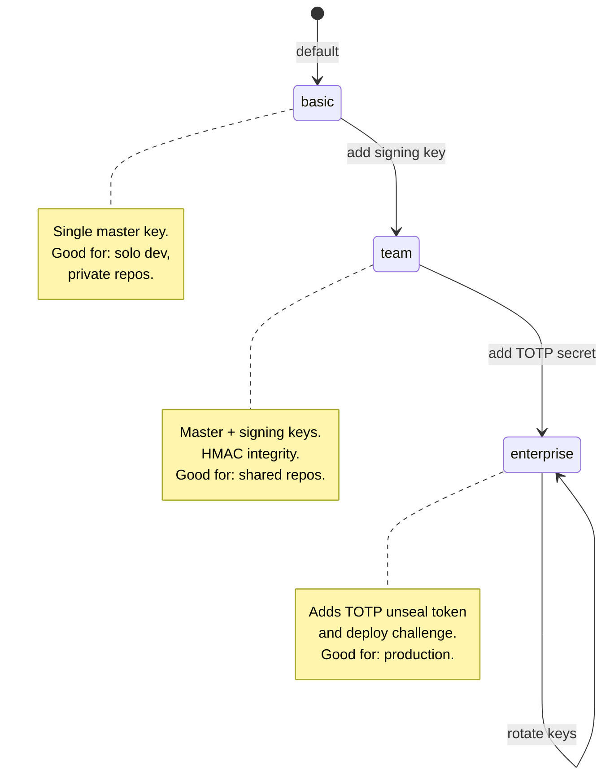

# Quick start — Node

## Install

```bash
npm install sealed-env
```

Zero runtime dependencies. Works on Node 20+ (Linux, macOS, Windows).

## Seal a `.env`

```bash
# Generate a 32-byte master key (keep it OUT of the repo)
openssl rand -hex 32 > master.key

# Seal
SEALED_ENV_KEY=$(cat master.key) npx sealed-env seal .env
# → writes .env.sealed
```

The `.env.sealed` file is plain UTF-8 text — `git diff` will show metadata
changes line by line.



## Load at startup

```js
import { loadSealed } from "sealed-env";

// Reads .env.sealed, decrypts using SEALED_ENV_KEY, populates process.env
loadSealed();

console.log(process.env.API_KEY); // → real value
```

## Mode selection



To upgrade modes:

```bash
# Generate signing key for team mode
openssl rand -hex 32 > signing.key

# Re-seal as team
SEALED_ENV_KEY=$(cat master.key) \
SEALED_ENV_SIGNING_KEY=$(cat signing.key) \
npx sealed-env seal --mode team .env
```

For the full enterprise flow (TOTP + deploy challenge), see
[Enterprise mode](./05-enterprise-mode.md).
