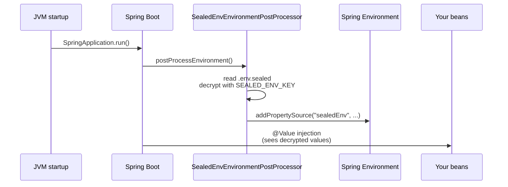
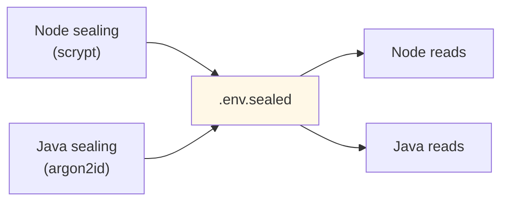

# Quick start — Java + Spring Boot

## Install

```xml
<dependency>
  <groupId>io.github.davidalmeidac</groupId>
  <artifactId>sealed-env-spring-boot-starter</artifactId>
  <version>0.1.0-alpha.1</version>
</dependency>
```

Or for non-Spring Java apps:

```xml
<dependency>
  <groupId>io.github.davidalmeidac</groupId>
  <artifactId>sealed-env-core</artifactId>
  <version>0.1.0-alpha.1</version>
</dependency>
```

Requires Java 17+. Bouncy Castle is the only runtime dependency (for Argon2id).

## Spring Boot integration

The starter auto-registers an `EnvironmentPostProcessor` that runs **before**
property binding, so `@Value` and `@ConfigurationProperties` see the decrypted
values.



### Configure

`application.yml`:
```yaml
sealed-env:
  enabled: true
  path: .env.sealed
  fail-fast: true       # production: hard fail if file missing/key wrong
  override: false       # explicit application properties win
```

### Run

```bash
SEALED_ENV_KEY=$(cat master.key) \
SEALED_ENV_SIGNING_KEY=$(cat signing.key) \
java -jar your-app.jar
```

For enterprise mode you also pass `SEALED_ENV_UNSEAL_TOKEN` (generated
fresh on each deploy by the operator running `sealed-env unseal`) and
`SEALED_ENV_DEPLOY_ID` (typically the commit SHA).

## Programmatic API (no Spring)

```java
import io.github.davidalmeidac.sealedenv.SealedEnv;

var opts = new SealedEnv.LoadOptions();
opts.path = Path.of(".env.sealed");
opts.populateSystem = true;   // copy to System.getProperties

Map<String, String> env = SealedEnv.loadSealed(opts);
String apiKey = env.get("API_KEY");
```

## Cross-stack: Java decrypting a Node-sealed file

This is automatic. The `.env.sealed` file format is identical across both
implementations. The Node CLI writes `KDF=scrypt` (Node 22 stdlib has no
Argon2id); the Java reader supports both Argon2id and scrypt natively.


