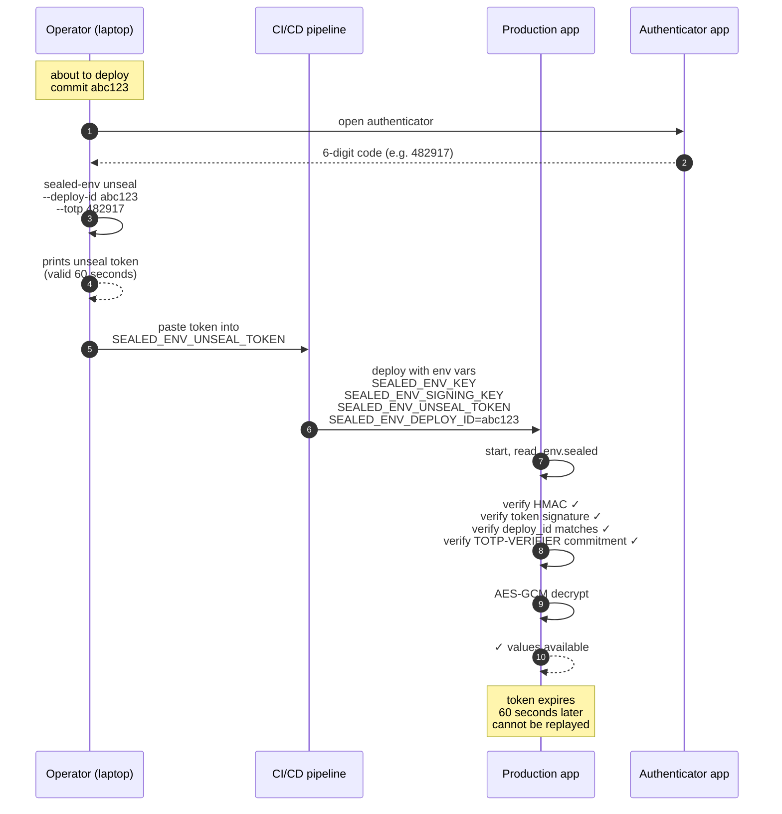
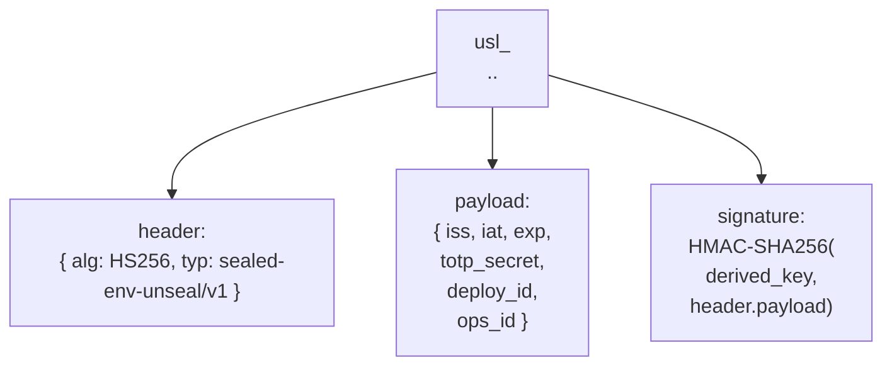
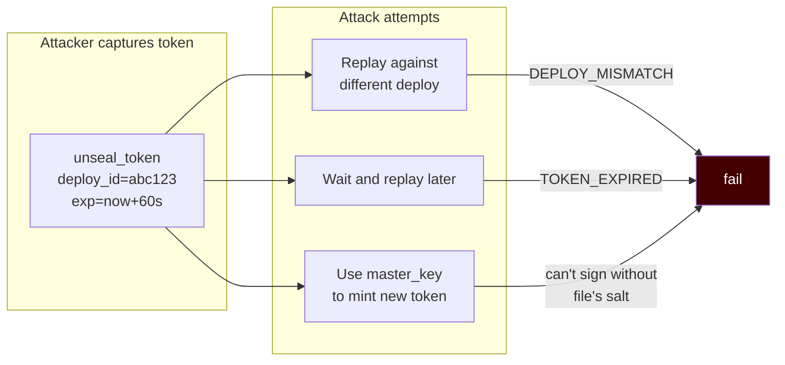

# Enterprise mode — TOTP + deploy challenge

Enterprise mode adds two layers on top of `team`:

1. **TOTP unseal token** — at decryption time the application requires a
   short-lived token that the operator generated by entering a fresh 6-digit
   TOTP code.
2. **Deploy challenge binding** — the token is bound to a specific deploy
   id (typically the commit SHA), so a captured token can't be replayed
   against a different deploy.

## End-to-end deploy flow

## What the token contains

Key properties:
- **Lifetime ≤ 600 seconds** (default 60). Short enough that a leaked token
  is rarely useful.
- **Signed with the file's `derived_key`** (master_key + salt-derived). A
  token cannot be forged from the master key alone — you also need the
  file's salt, which means you need the file.
- **`totp_secret` is committed at seal time** via the `TOTP-VERIFIER` field
  (an HMAC commitment). The token's TOTP secret must match what was sealed
  in, so an attacker cannot mint a token from a different TOTP secret.

## What this protects against

## When to use it

Use enterprise mode when:
- The threat model includes a compromised CI/CD step (the 2025 tj-actions
  pattern).
- Your team can integrate a 30-second extra step into deploys (entering a
  TOTP code).
- You want auditable evidence of human approval per deploy (`ops_id` is
  unique per token).

Skip enterprise mode when:
- You're deploying many times per day automatically (no human in the loop).
  Use `team` mode instead and gate access at the CI level.
- You're a solo dev. The operational overhead doesn't pay back.

## Key rotation

`enterprise` mode does **not** make rotation optional. After any incident
or every 90 days:
1. Generate fresh `master_key`, `signing_key`, and `totp_secret`.
2. Re-seal `.env` with the new keys.
3. Delete the old sealed file (forward secrecy depends on this).
4. Distribute new keys via your KMS.
