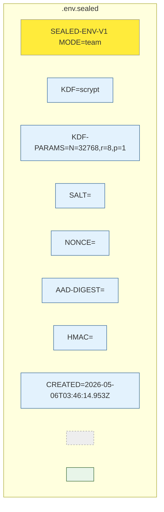
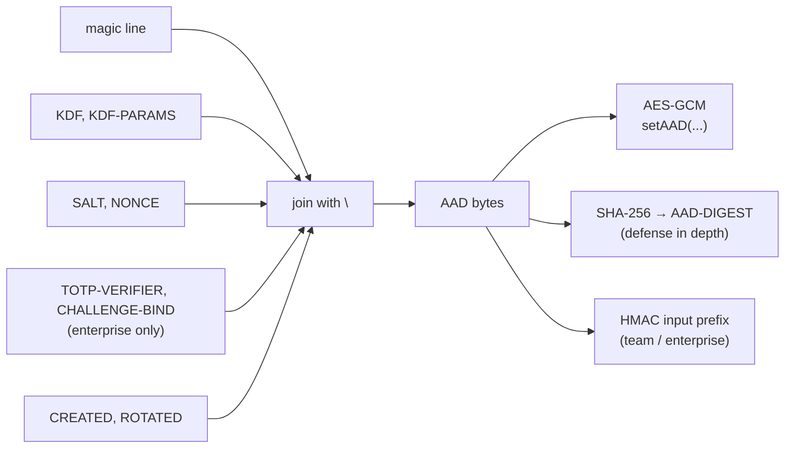

# File format anatomy

A `.env.sealed` file is plain UTF-8 text with three sections.



## The three sections

### 1. Magic line

```
SEALED-ENV-V1 MODE=<basic|team|enterprise>
```

Readers reject anything else. The mode is **part of the AAD**, so a `basic`
file cannot be silently parsed as `enterprise` to bypass TOTP — the GCM tag
verification fails.

### 2. Metadata

`KEY=VALUE` lines, in the canonical order from the spec:

| Field | Required in | Notes |
|---|---|---|
| `KDF` | all | `argon2id` (Java writer) or `scrypt` (Node writer) |
| `KDF-PARAMS` | all | Format depends on KDF |
| `SALT` | all | 16 bytes, fed to KDF |
| `NONCE` | all | 12 bytes, fed to AES-GCM |
| `TOTP-VERIFIER` | enterprise | HMAC commitment to the TOTP secret |
| `CHALLENGE-BIND` | enterprise | `enabled` or `disabled` |
| `AAD-DIGEST` | all | SHA-256 over the bound metadata |
| `HMAC` | team, enterprise | HMAC-SHA256 over magic + metadata + ciphertext |
| `CREATED` | all | ISO-8601 UTC |
| `ROTATED` | optional | Last rotation timestamp |

### 3. Body

A single base64 line containing `ciphertext || gcm_tag`.

## How AAD is built

The Additional Authenticated Data is the magic line + metadata fields,
**excluding** `AAD-DIGEST` and `HMAC`, joined by `\n` with no trailing
newline.



This means **any tampering with metadata** breaks the GCM tag and (for
team/enterprise) the HMAC. There's no "header rewrite" attack.

## Why text and not binary?

Three reasons:

1. **`git diff` shows what changed** — a metadata-only rotation looks
   different in review than a ciphertext rotation.
2. **Editors and pipes work** — you can `cat`, `grep`, `tail` it without
   binary-handling tooling.
3. **Engineers can sanity-check** — `head -1 .env.sealed` immediately tells
   you the version and mode without a parser.

The cost is base64 overhead (~33%), which is irrelevant for files measured
in kilobytes.
